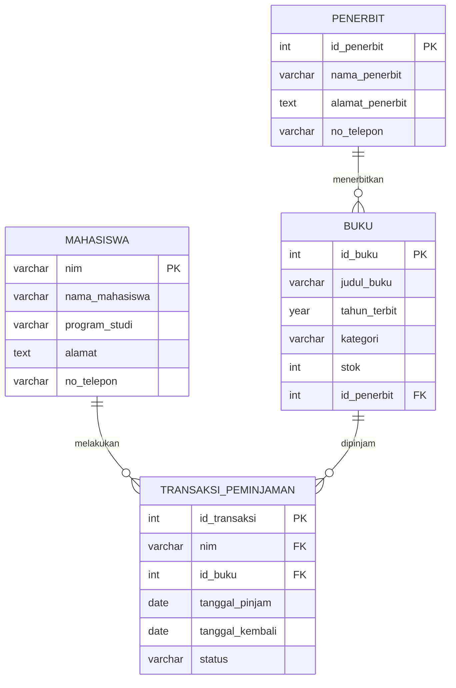

# Perancangan Database E-Library Kampus

## Identitas Mahasiswa 
- **Nama : Gizalda Risqia Kirani Subehang**
- **NIM : D121241098**

# 1. Deskripsi Sistem 
E-Library Kampus merupakan sistem basis data yang digunakan untuk mengelola data dan proses peminjaman serta pengembalian buku di perpustakaan kampus. Sistem ini menyimpan informasi mengenai mahasiswa sebagai pengguna perpustakaan, data buku, data penerbit serta riwayat transaksi peminjaman dan pengembalian buku. Perancangan database ini dibuat menggunakan model basis data relasional agar data tersimpan secara terstruktur, mengurangi redundansi, serta menjaga konsistensi dan integritas data.

# 2. Tujuan Perancangan Database
Tujuannya adalah :

1. Membuat struktur penyimpanan data perpustakaan yang terorganisir.
2. Menyimpan data mahasiswa, buku, penerbit dan transaksi peminjaman
   secara terstruktur.
3. Mengurangi redundansi data.
4. Menjaga hubungan antar tabel menggunakan Primary Key dan Foreign Key.
5. Memudahkan pengelolaan riwayat peminjaman dan pengembalian buku.
6. Menjadi dasar database yang dapat digunakan dalam pengembangan
   aplikasi E-Library berbasis web.

# 3. Kebutuhan Sistem
Berdasarkan studi kasus, sistem harus menyimpan dan mengelola:

- Data mahasiswa sebagai pengguna perpustakaan.
- Data buku yang tersedia di perpustakaan.
- Data penerbit dari setiap buku.
- Data transaksi peminjaman buku.
- Data pengembalian buku.
- Hubungan antara mahasiswa, buku, penerbit, dan transaksi peminjaman.

# 4. Perancangan Entity Relationship Diagram

## 4.1 Entitas Mahasiswa 
Digunakan untuk menyimpan data mahasiswa yang terdaftar sebagai pengguna perpustakaan.

| Atribut | Keterangan | Key |
|---|---|---|
| nim | Nomor induk mahasiswa | Primary Key |
| nama_mahasiswa | Nama mahasiswa | - |
| program_studi | Program studi mahasiswa | - |
| alamat | Alamat mahasiswa | - |
| no_telepon | Nomor telepon mahasiswa | - |

## 4.2 Entitas Buku 
Digunakan untuk menyimpan informasi mengenai buku yang tersedia di perpustakaan.

| Atribut | Keterangan | Key |
|---|---|---|
| id_buku | Identitas unik buku | Primary Key |
| judul_buku | Judul buku | - |
| tahun_terbit | Tahun terbit buku | - |
| kategori | Kategori buku | - |
| stok | Jumlah buku yang tersedia | - |
| id_penerbit | Identitas penerbit buku | Foreign Key |

## 4.3 Entitas Penerbit
Digunakan untuk menyimpan informasi mengenai penerbit yang menerbitkan buku.

| Atribut | Keterangan | Key |
|---|---|---|
| id_penerbit | Identitas unik penerbit | Primary Key |
| nama_penerbit | Nama penerbit | - |
| alamat_penerbit | Alamat penerbit | - |
| no_telepon | Nomor telepon penerbit | - |

## 4.4 Entitas Transaksi Peminjaman
Digunakan untuk mencatat aktivitas peminjaman dan pengembalian buku yang dilakukan oleh mahasiswa.

| Atribut | Keterangan | Key |
|---|---|---|
| id_transaksi | Identitas unik transaksi | Primary Key |
| nim | Identitas mahasiswa yang meminjam | Foreign Key |
| id_buku | Identitas buku yang dipinjam | Foreign Key |
| tanggal_pinjam | Tanggal buku dipinjam | - |
| tanggal_kembali | Tanggal buku dikembalikan | - |
| status | Status transaksi peminjaman | - |

## 4.5 Relasi Antar Entitas
Relasi antar entitas dalam database E-Library adalah sebagai berikut:

1. Satu mahasiswa dapat melakukan banyak transaksi peminjaman.
2. Setiap transaksi peminjaman dilakukan oleh satu mahasiswa.
3. Satu buku dapat tercatat dalam banyak transaksi peminjaman pada waktu
   yang berbeda.
4. Setiap transaksi peminjaman berkaitan dengan satu buku.
5. Satu penerbit dapat menerbitkan banyak buku.
6. Setiap buku diterbitkan oleh satu penerbit.

Dengan demikian, hubungan antar entitas adalah:

- Mahasiswa dengan Transaksi Peminjaman = **1 : N**
- Buku dengan Transaksi Peminjaman = **1 : N**
- Penerbit dengan Buku = **1 : N**

# 5. Simulasi Normalisasi Database
Normalisasi untuk mengurangi redundansi data dan mencegah terjadinya anomali pada proses penambahan, perubahan maupun penghapusan data. Tahapan normalisasi yang digunakan adalah UNF, 1NF, 2NF, dan 3NF.

## 5.1 Unnormalized Form (UNF)
Pada tahap UNF, data masih disimpan dalam satu struktur yang belum terorganisir dan dapat mengandung nilai yang berulang atau lebih dari satu nilai dalam satu atribut.

Contoh data peminjaman dalam bentuk UNF:

| NIM | Nama Mahasiswa | Buku yang Dipinjam | Penerbit | Tanggal Pinjam | Tanggal Kembali |
|---|---|---|---|---|---|
| 23001 | Ryul | Basis Data, Pemrograman Web | Informatika Press, EduMedia | 01-10-2026, 02-10-2026 | 08-10-2026, 09-10-2026 |

Pada contoh tersebut, atribut Buku yang Dipinjam, Penerbit, Tanggal Pinjam, dan Tanggal Kembali masih memiliki lebih dari satu nilai dalam satu baris.

Permasalahan pada bentuk UNF:

- Terdapat atribut yang memiliki nilai lebih dari satu.
- Data masih bercampur dalam satu struktur.
- Terjadi pengulangan data.
- Data belum memenuhi prinsip nilai atomik.

## 5.2 First Normal Form (1NF)
Untuk mencapai First Normal Form (1NF), setiap atribut harus memiliki nilai yang bersifat atomik atau hanya memiliki satu nilai dalam setiap sel. Data yang sebelumnya memiliki beberapa buku dalam satu baris dipisahkan menjadi beberapa baris.

Contoh setelah dilakukan normalisasi menjadi 1NF:

| NIM | Nama Mahasiswa | ID Buku | Judul Buku | ID Penerbit | Tanggal Pinjam | Tanggal Kembali |
|---|---|---|---|---|---|---|
| 23001 | Ryul | B001 | Basis Data | P001 | 01-10-2026 | 08-10-2026 |
| 23001 | Ryul | B002 | Pemrograman Web | P002 | 02-10-2026 | 09-10-2026 |

Pada bentuk 1NF, setiap sel sudah memiliki satu nilai sehingga tidak terdapat lagi atribut multivalue. Namun, masih terdapat pengulangan data mahasiswa dan beberapa data buku. Oleh karena itu, normalisasi perlu dilanjutkan ke tahap 2NF.

## 5.3 Second Normal Form (2NF)
Untuk mencapai Second Normal Form (2NF), tabel harus memenuhi 1NF dan setiap atribut non-key harus bergantung sepenuhnya pada Primary Key. Pada bentuk 1NF masih terdapat pengulangan data mahasiswa dan data buku. Oleh karena itu, data yang memiliki ketergantungan terhadap entitas tertentu dipisahkan menjadi tabel yang berbeda.

### Tabel Mahasiswa

| NIM | Nama Mahasiswa | Program Studi | Alamat | No Telepon |
|---|---|---|---|---|
| 23001 | Ryul | Teknik Informatika | Bandung | 08123456789 |

### Tabel Buku

| ID Buku | Judul Buku | ID Penerbit |
|---|---|---|
| B001 | Basis Data | P001 |
| B002 | Pemrograman Web | P002 |

### Tabel Transaksi Peminjaman

| ID Transaksi | NIM | ID Buku | Tanggal Pinjam | Tanggal Kembali |
|---|---|---|---|---|
| T001 | 23001 | B001 | 01-10-2026 | 08-10-2026 |
| T002 | 23001 | B002 | 02-10-2026 | 09-10-2026 |

Pada tahap 2NF, data mahasiswa dan data buku tidak lagi ditulis berulang dalam tabel transaksi. Setiap tabel memiliki data yang berkaitan langsung dengan entitasnya masing-masing. Namun, pada tabel Buku masih terdapat informasi mengenai penerbit yang memiliki atributnya sendiri. Oleh karena itu, normalisasi dilanjutkan ke tahap 3NF.

## 5.4 Third Normal Form (3NF)
Untuk mencapai Third Normal Form (3NF), tabel harus memenuhi 2NF dan tidak boleh terdapat ketergantungan transitif yaitu ketika atribut non-key bergantung pada atribut non-key lainnya. Pada tabel Buku terdapat `id_penerbit` yang digunakan untuk menunjukkan penerbit buku. Informasi mengenai penerbit seperti nama dan alamat penerbit tidak perlu disimpan langsung di dalam tabel Buku. Oleh karena itu, informasi penerbit dipisahkan menjadi tabel Penerbit.

### Tabel Penerbit

| ID Penerbit | Nama Penerbit | Alamat Penerbit | No Telepon |
|---|---|---|---|
| P001 | Informatika Press | Bandung | 0221234567 |
| P002 | EduMedia | Jakarta | 0219876543 |

### Tabel Buku Setelah 3NF

| ID Buku | Judul Buku | ID Penerbit |
|---|---|---|
| B001 | Basis Data | P001 |
| B002 | Pemrograman Web | P002 |

Dengan pemisahan tersebut, informasi penerbit tidak perlu ditulis berulang pada setiap data buku. Tabel Buku cukup menyimpan `id_penerbit` sebagai Foreign Key yang mengacu pada tabel Penerbit.

### Hasil Normalisasi
Setelah melalui tahapan UNF, 1NF, 2NF, dan 3NF, struktur database terdiri dari empat tabel utama:

1. **Mahasiswa**
2. **Buku**
3. **Penerbit**
4. **Transaksi Peminjaman**

Struktur tersebut mengurangi redundansi data dan membuat hubungan antar entitas menjadi lebih terorganisir.

# 6. Rancangan Tabel Akhir
Setelah proses normalisasi hingga 3NF, diperoleh empat tabel utama yang digunakan dalam database E-Library Kampus, yaitu tabel Mahasiswa, Penerbit, Buku, dan Transaksi Peminjaman.

## 6.1 Tabel Mahasiswa

| Field | Tipe Data | Key | Keterangan |
|---|---|---|---|
| nim | VARCHAR(20) | PK | Nomor induk mahasiswa |
| nama_mahasiswa | VARCHAR(100) | - | Nama mahasiswa |
| program_studi | VARCHAR(100) | - | Program studi mahasiswa |
| alamat | TEXT | - | Alamat mahasiswa |
| no_telepon | VARCHAR(20) | - | Nomor telepon mahasiswa |

Primary Key pada tabel Mahasiswa adalah `nim`.

## 6.2 Tabel Penerbit

| Field | Tipe Data | Key | Keterangan |
|---|---|---|---|
| id_penerbit | INT | PK | Identitas unik penerbit |
| nama_penerbit | VARCHAR(100) | - | Nama penerbit |
| alamat_penerbit | TEXT | - | Alamat penerbit |
| no_telepon | VARCHAR(20) | - | Nomor telepon penerbit |

Primary Key pada tabel Penerbit adalah `id_penerbit`.

## 6.3 Tabel Buku

| Field | Tipe Data | Key | Keterangan |
|---|---|---|---|
| id_buku | INT | PK | Identitas unik buku |
| judul_buku | VARCHAR(200) | - | Judul buku |
| tahun_terbit | YEAR | - | Tahun terbit buku |
| kategori | VARCHAR(100) | - | Kategori buku |
| stok | INT | - | Jumlah buku yang tersedia |
| id_penerbit | INT | FK | Identitas penerbit buku |

Primary Key pada tabel Buku adalah `id_buku`.

Foreign Key `id_penerbit` mengacu pada `id_penerbit` pada tabel Penerbit.

## 6.4 Tabel Transaksi_Peminjaman

| Field | Tipe Data | Key | Keterangan |
|---|---|---|---|
| id_transaksi | INT | PK | Identitas unik transaksi |
| nim | VARCHAR(20) | FK | Mahasiswa yang melakukan peminjaman |
| id_buku | INT | FK | Buku yang dipinjam |
| tanggal_pinjam | DATE | - | Tanggal peminjaman |
| tanggal_kembali | DATE | - | Tanggal pengembalian |
| status | VARCHAR(20) | - | Status transaksi |

Primary Key pada tabel Transaksi_Peminjaman adalah `id_transaksi`.

Foreign Key `nim` mengacu pada `nim` pada tabel Mahasiswa.

Foreign Key `id_buku` mengacu pada `id_buku` pada tabel Buku.

# 7. Diagram Relasi Database
Diagram berikut menunjukkan hubungan antar tabel pada database E-Library Kampus.

# 8. Kesimpulan 
Perancangan database E-Library Kampus menghasilkan empat entitas utama yaitu Mahasiswa, Buku, Penerbit dan Transaksi Peminjaman. Proses normalisasi dilakukan mulai dari UNF, 1NF, 2NF hingga 3NF untuk mengurangi redundansi data dan mencegah terjadinya anomali pada proses
penyimpanan, perubahan maupun penghapusan data. Hasil akhir perancangan terdiri dari empat tabel yang saling berhubungan menggunakan Primary Key dan Foreign Key. Relasi tersebut memungkinkan sistem untuk menyimpan data mahasiswa, buku, penerbit, serta riwayat peminjaman dan pengembalian secara terstruktur. Rancangan database ini dapat digunakan sebagai dasar dalam pengembangan sistem E-Library Kampus berbasis web.